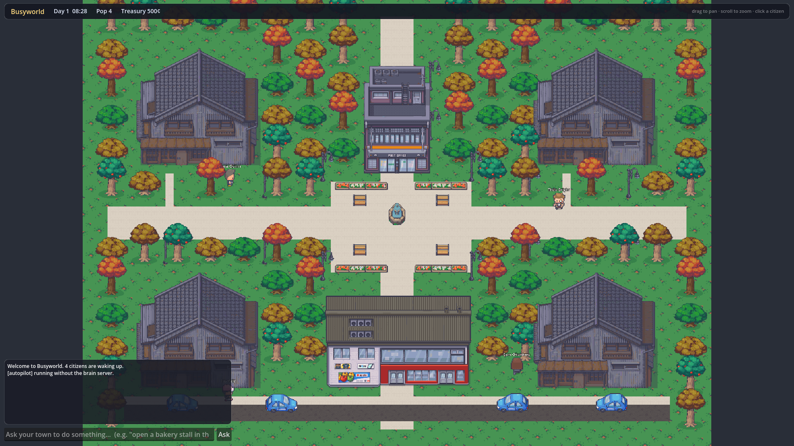
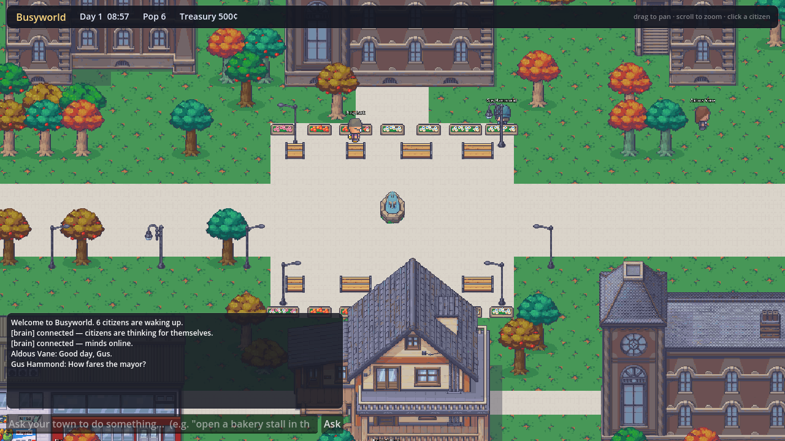

# Busyworld

**A living 2D pixel-art town inhabited by local AI citizens.**

Busyworld is a simulated town where every citizen is driven by its own local
language model. They have bodies, jobs, homes, memories and relationships. They
walk the streets, work their trades, gossip in the plaza, and — when you ask them
to — take on projects for you. Each mind runs on **your** hardware (any machine
running [Ollama](https://ollama.com)), so the town can be spread across many
computers, even a rack of Raspberry Pis.

It is built to **grow**: one town today, with the architecture in place to become
many towns, cities and countries with thousands of citizens.



> Pixel art: LimeZu *Modern Interiors / Modern Exteriors* (see [Credits](#credits)).

---

## What works today

- A handcrafted **pixel-art town** — plaza & fountain, town hall, shops, an inn,
  a clinic, a school, a workshop, a farm, homes, tree-lined streets and a day/night
  cycle.
- **12 citizens with essential roles** — mayor, shopkeeper, baker, doctor, teacher,
  builder, farmer, innkeeper, gardener, constable, artist, engineer. Start as few
  or as many as you like.
- Each citizen is a **local LLM** (via Ollama) with **persistent memory** that
  outlives any context window — they remember across restarts and live indefinitely.
- **Embodied perception**: citizens don't get "you hit a wall." They sense named
  places with compass bearings and distances, the *aesthetics* of where they stand,
  who is nearby and within earshot, the time of day, and recent events — optionally
  including a **rendered image** of their surroundings for vision-capable models.
- **Spatial awareness & conversation**: citizens know who is close enough to talk
  to, and speak in bubbles you can read; they form **relationships** over time.
- **Enterable interiors**: click any building to step inside a furnished home or
  shop and see the citizens who live and work there; animated doors throughout.
- **Needs & economy**: citizens get hungry and eat from a town larder, hold coins,
  and rest at home — the founder provides **food** and **virtual money** to keep
  them going.
- **Eyesight (optional)**: vision-capable citizens are sent a rendered image of
  their surroundings, so they truly *see* the town.
- **Ask your town**: type a request ("open a bakery stall in the plaza") and the
  town takes it on. Good work earns the town's coin, which is shared back to the
  citizens as a **simulated incentive**.
- Runs on **Linux, macOS and Windows**. The town lives even with **no models
  running** (citizens fall back to instinct), so you can try it instantly.



---

## Architecture

Busyworld is two cooperating processes, exactly the client/server split the design
calls for:

```
                 perception (JSON, + optional image)
   ┌─────────────┐ ───────────────────────────────▶ ┌──────────────────┐   /api/chat   ┌───────────────┐
   │   GODOT      │                                   │  BRAIN SERVER    │ ────────────▶ │  Ollama #1    │ (mayor)
   │  the town    │                                   │  (Python,        │               └───────────────┘
   │              │ ◀─────────────────────────────── │   WebSocket)     │ ────────────▶ ┌───────────────┐
   │ space + time │     action (move/work/say…)       │  minds + memory  │               │  Ollama #2    │ (baker)
   │ authoritative│                                   │  + economy       │               └───────────────┘
   └─────────────┘                                   └──────────────────┘   each citizen → its own IP:port
```

- **Godot** is authoritative for the *physical* world — positions, movement,
  collisions, pathfinding, time, rendering. It never blocks on a model: it sets
  goals and animates smoothly while minds think in the background.
- The **brain server** is authoritative for each citizen's *mind* — it turns
  perception into a decision by prompting that citizen's model, then persists the
  result (memory, mood, goals, coins) to SQLite.
- **Ollama minds** are wherever you put them. Each citizen can point at a different
  host/port/model in `brain/agents.yaml`.

See [`docs/ARCHITECTURE.md`](docs/ARCHITECTURE.md) for the protocol and internals,
and [`docs/WORLD_GUIDE.md`](docs/WORLD_GUIDE.md) for the guide every citizen is
given (how they perceive and act, including multimodality).

---

## Quick start

### 1. Prerequisites
- **[Godot 4.3](https://godotengine.org/download)** (standard build; the GL
  Compatibility renderer is used, so it runs almost anywhere).
- **Python 3.10+**.
- *(Optional, for real AI minds)* **[Ollama](https://ollama.com)** with at least
  one chat model, e.g. `ollama pull llama3.2:3b`.

### 2. Install the brain's Python deps
```bash
pip install -r brain/requirements.txt
```

### 3. Run it
```bash
# Linux / macOS
./run.sh --agents 6

# Windows
run.bat --agents 6

# or directly, anywhere
python3 launch.py --agents 6
```

`launch.py` starts the brain server and the town together. If it can't find a
Godot binary it will tell you — just open the `godot/` folder in the Godot editor
and press **Play** (the brain keeps running in the background).

**Try it with no models at all:** run it as above without Ollama. Every citizen
falls back to a believable heuristic, so you immediately get a living town. Start
Ollama and the same citizens begin thinking for themselves.

### Controls
- **Drag** to pan, **scroll** to zoom.
- **Click a citizen** to inspect their role, mood, goal, last thought and coins.
- **Click a building** to step inside; **Leave** returns to town.
- Type in the **"Ask your town…"** box to send a request, or provide for the town:
  e.g. *"give 30 food"* restocks the larder, *"give 50 coins"* pays every citizen.

---

## Choosing how many citizens start

The cast lives in [`godot/data/citizens.json`](godot/data/citizens.json) (12
citizens, top to bottom). `--agents N` starts the **first N**:

```bash
python3 launch.py --agents 2      # just the mayor and the shopkeeper
python3 launch.py --agents 12     # the whole town
```

You can also set `default_agent_count` in
[`godot/data/world_config.json`](godot/data/world_config.json).

---

## Giving each citizen its own model / machine

Infrastructure lives in [`brain/agents.yaml`](brain/agents.yaml). Point each
citizen at any Ollama endpoint — a different IP and port per citizen if you like
(e.g. one Raspberry Pi each):

```yaml
defaults:
  host: "127.0.0.1"
  port: 11434
  model: "llama3.2:3b"

agents:
  mayor:
    host: "192.168.1.50"      # the mayor thinks on this machine…
    port: 11434
    model: "llama3.1:8b"
    vision: true              # …and can see
    model_vision: "llama3.2-vision:11b"
  baker:
    host: "192.168.1.51"      # …the baker on another
    model: "qwen2.5:3b"
```

Citizens are matched to `citizens.json` by `id`. Anyone without an entry uses
`defaults`. Unreachable models fall back to instinct automatically.

**Which models?** See [`docs/MODELS.md`](docs/MODELS.md) — small models like
`qwen2.5:3b` (the default) run the whole town well; give the mayor a bigger one;
Raspberry Pis can run 1–3B models. Picking up the project in a new session?
Start with [`docs/HANDOFF.md`](docs/HANDOFF.md).

---

## Asking your town to do things (and the money loop)

When you ask the town to do something, the request becomes a **town directive**:
the mayor announces it, it's injected into every citizen's awareness, and citizens
whose role fits start working toward it. Productive work pays **coins** into the
town **treasury** and into the workers' own purses — the simulated-incentive loop
you steer the town with.

The framework for turning a directive into a real, revenue-bearing **enterprise**
(a store that earns actual money) is scaffolded in `brain/memory.py`
(`enterprises`) and `brain/server.py`. Wiring an enterprise to a real payment
processor or storefront is the next milestone — see the roadmap. *(No real
financial integrations are enabled by default; that requires your accounts and
explicit setup.)*

---

## Project layout

```
busyworld/
├── launch.py            one-command launcher (brain + town)
├── run.sh / run.bat     OS wrappers
├── godot/               the Godot 4.3 project (the town)
│   ├── project.godot
│   ├── scenes/Main.tscn
│   ├── scripts/         World, Agent, TownBuilder, HUD, Net, CharacterFrames…
│   └── data/            citizens.json, world_config.json, town_layout.json (generated)
├── brain/               the Python brain server (the minds)
│   ├── server.py        WebSocket middleware
│   ├── mind.py          perception → prompt → decision → memory → incentives
│   ├── memory.py        SQLite persistence (lives indefinitely)
│   ├── ollama_client.py async chat + vision
│   ├── config.py        loads the cast + endpoints
│   └── agents.yaml      per-citizen Ollama endpoints
├── docs/                WORLD_GUIDE.md, ARCHITECTURE.md, ROADMAP.md
├── tools/               asset + town generators, headless run/screenshot helpers
└── GameAssets/          the LimeZu source art
```

The town's ground, buildings and props are generated from the source art by
`tools/build_town.py`, which bakes `godot/assets/ground/town_ground.png` and emits
`godot/data/town_layout.json` (the single source of truth the game reads). Re-run
it after editing the layout. `tools/select_assets.py` curates the sprites used.

---

## Roadmap

The near-term path to the full vision is in [`docs/ROADMAP.md`](docs/ROADMAP.md):
expanding to multiple districts and towns, real (vision-model) eyesight, citizens
reaching out to the internet through the brain, and turning the enterprise
scaffold into ventures that earn real-world money. The architecture — an
authoritative world, distributed minds, and per-citizen persistence — is built
for that growth.

---

## Credits

- **Art:** *Modern Interiors* & *Modern Exteriors* by **LimeZu**
  (<https://limezu.itch.io/>). Please keep a valid LimeZu license for any
  distribution — the art is **not** covered by this project's license.
- **Engine:** [Godot](https://godotengine.org). **Minds:** [Ollama](https://ollama.com).
